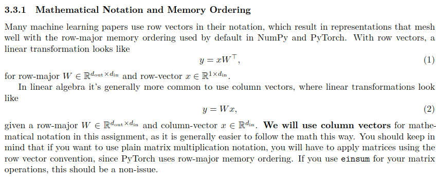

# 如何建立一个大模型？
谨为本人浅见，必有错漏

## 分词？BPE?
bpe_train.py 
tokenizer.py

计算机处理的数据是基于底层的二进制码，再上一层是字节，与字符编码，根据规定的字符编码可以转为各种语言的文字。

目前常用的UTF-8编码是目前最流行的字符编码方式，兼容ASCII码，能够表示世界上绝大多数的文字和符号。UTF-8使用1到4个字节来编码一个字符，具有以下特点：
- 对于ASCII字符（U+0000到U+007F），UTF-8使用单字节编码，与ASCII码完全兼容。
- 对于其他字符，UTF-8使用多字节编码，具体使用多少字节取决于字符的Unicode码点

那么显然我们要做的，就是把文本转换成UTF-8编码的字节序列，转换成计算机可以处理的形式。
但这只能让我们单纯的转换字符，而不知道如何组成一个单词，或者一个词组，甚至一个句子。我们需要一种方法来把文本切分成更有意义的单元，这就是分词：

- BPE / BBPE (Byte-level BPE)

    优点： 简单高效，能完美解决 OOV 问题（尤其是字节级 BBPE，可以编码任何 Unicode 字符）。

    缺点： 基于频率合并具有某种“贪心”特质，可能导致某些合并在语义上并不合理（例如将 the 和 re 合并，仅仅因为它们经常一起出现）。

- WordPiece

    优点： 相比 BPE，它更关注合并后的 Token 对语言建模的贡献（互信息更大），生成的子词往往更具语义代表性。

    缺点： 训练计算量比 BPE 稍大。

- Unigram

    优点： 基于概率分布，能够提供多种分词路径（Subword Regularization），增加模型的鲁棒性。

    缺点： 实现复杂度较高。

为什么我们采用 BPE？因为它简单高效，能够解决多语言、OOV等问题，并且相比WordPiece和Unigram对计算资源的要求更低。

### Step1: bpe_train
落实到具体实现，我们需要：
1. 文本转换为字节
2. 统计频率并进行合并

#### 文本转换为字节
这一部分也是最简单的，只需要遍历处理并保存一次即可。但是对于大规模文本数据，直接读取到内存肯定是不现实的，所以我们必须进行并行处理。

要求文档里有介绍，助教实现了pretokenization函数，这个函数的功能是预先规划好文本大致切成几块进行并行，那么直接用指针从切分点向后查找，
查找到specal_token也就是文本切分符返回切分点，这样就得到了一个关于文本切分情况定位表，这样就可以按需丢进并行池进行处理了。（这里采用了multiprocessing库构建pool）

**Tips:** 
1. 关于这个文本大小如何选择也遇到过bug,2G正常的情况下，10GOOV我就只简单除以了8最后还是OOV,推测可能是网络爬虫抓取的垃圾信息太多，导致文本中有大量的特殊字符。
   于是听从ai,切的更小然后多次投递，决策如下：
    ```python
    chunk_size = 32 * 1024 * 1024  # 强制规定每块约 32MB
    # 确保至少有 num_workers * 4 块，但遇到 11GB 文件时会切成约 350 块
    desired_chunks = max(num_workers * 4, math.ceil(file_size / chunk_size))
   ```

2. 还有存储问题提到现在讲，对一个10G的材料，转字节存一次10G,合并得到词表和合并规则加起来又是10G,把文本按合并规则进行转化又是10G
    这就导致了存储空间的压力，最后通过挂载windows分区在同一个电脑上进行软链接：
    ```bash
    # 在Linux系统上创建软链接
    # 格式：ln -s "目标(Windows里的路径)" "链接名(Ubuntu里的路径)"
    ln -s "/media/fancy/你的磁盘名/UbuntuData/data" data
    ```

3. 和ai对话可能跑偏。在这个过程中，ai根据网上自己搜索到关于gpt2训练的资料，告诉我关于不可见字符向后映射，进行处理。
    但实际通过PAT正则划分，不可见已经不是问题，那么这个向后映射只是对性能的浪费以及增加划分失误的风险。

###### PAT切词
为了避免近似词元重复占用词表，以及有无空格的冲突等，采用PAT正则化规则确保格式一样，只在单一词内进行合并，而后再转换为字节进行统计和合并。
```python
import regex as re
PAT = re.compile(r"""'s|'t|'re|'ve|'m|'ll|'d| ?\p{L}+| ?\p{N}+| ?[^\s\p{L}\p{N}]+|\s+(?!\S)|\s+""")
```

#### 统计频率并进行合并
统计频率并进行合并的过程相对简单，主要是通过Counter统计频率，然后按照频率进行合并，直到达到预设的词表大小。

##### Maigic1：对单词合并而非文本
但是倘若合并完之后，重新遍历词表替换并统计次数，实在是过于效率低下。

我们最先想到的是，我们已经PAT正则化了所有的词，空格格式也一样，那么我们合并的只要是一个词就行而不需要重复很多遍，将多次遍历降级为乘法。

##### Magic2：一次遍历干完大部分事情。
尽管对词合并已经可以节约大半资源，但还是不够。面对网络爬虫数据，大量无意义字符串在一起会让词种类爆炸，遍历所有词类的表依然是巨大的开销。
那么我们第一次遍历这个初始词类表的时候，就应当保存这个词对在哪几个词出现过，用空间去换时间。这样我们就可以查找针对性修改这些词而不是全部遍历，毕竟哈希表O(1)的查询效率是非常高的。

##### Magic3:合并处理
这边我考虑了两种方法，因为对于一个词（以'accompany'举例），它有8个词对，但我合并'cc'时，只需要对其中三个进行修改，那么剩下五个依然是不变的。
但是我并不知道这个cc什么时候出现，我要么需要遍历这个词先找位置，要么还得在Magic2得到的映射表里增添出现位置的属性，这都过于繁琐。

那么我们就干脆把映射表得到的词全部删除再添加，先遍历一边old_word每次-freq,再遍历一次new_word每次+freq，这样就能保证每个词只遍历两次，效率大大提升。

##### Alternative Magic4: 是否并行？
在这些优化下，我们只需要半个小时左右就能训练完10G的网络数据并得到词表和合并规则，那么并行是不是可以更快呢？（观察到Core4始终爆满）

理论是可以的，而且网络数据慢的原因一方面是大，一方面是乱码多导致原始词表过于庞大（猜测），那么这时候并行就十分有优势。

但是这样就代表我们需要将pair_to_word的映射表合理切分，再分派给各个核心，而我们需要得到一万的词表，也就是说要不断反复分派产生分派回传的过程，或许会影响开销？（不清楚）

而且我们worker函数里就需要把去老存新的过程封装成一个新的函数，并且应当保存在自己核心的内存里，等到结束后一起修改，是否会影响效率呢？


### Step2: bpe_tokenizer(encode & decode）
这个部分的核心就是根据得到的词表和合并规则，把文本转换成token_id的过程。这个过程相对简单，主要是按照合并规则进行替换，直到无法再替换为止。

要点：
1. merge合并规则的优先级
2. tokenizer类保存一个b2k反向映射便于encode
3. decode如果输入的标记 ID 无法生成有效的 Unicode 字符串，则应将格式错误的字节替换为官方的 Unicode 替换字符 U+FFFD

#### Experiment
文档建议本地训练测试，实验发现关键在于，如何在保证封装的情况下，进行保存，遍历，读取等等（全部交给vibe coding了就）


## Transformer
于《Attention is All You Need》中被提出，彻底终结了循环神经网络（RNN）和长短期记忆网络（LSTM）的统治地位。

简单来说，Transformer 的核心功能是通过“自注意力机制”实现对序列数据的高效、并行处理。

常用的数据结构是(batch_size, seq_length, d_model)，其中 batch_size 是一次处理的样本数量，seq_length 是输入序列的长度（上下文），d_model 是每个 token 的特征维度。

这边可以借用一下ai总结出来的工业流程：

接下来，我为你梳理出文档中规定的**九大核心实现步骤**，这也将是我们接下来结对编程的路线图：

#### 第一阶段：底层叶子算子 (Basic Building Blocks)

- **步骤 1：纯净的线性层 (Linear Module)**
    
    - 实现一个继承自 `torch.nn.Module` 的自定义 `Linear` 类，执行 $y = Wx$ 的矩阵乘法 。
        
    - **核心约束**：不包含偏置项 (bias)，以对齐大多数现代 LLM 。必须使用截断正态分布进行参数初始化 ，均值为 0，方差为 $\frac{2}{d_{in}+d_{out}}$，并截断在 $[-3\sigma, 3\sigma]$ 

- **步骤 2：词嵌入字典 (Embedding Module)**
    
    - 实现一个自定义的 `Embedding` 类，通过高级索引进行查表 。
        
    - **核心约束**：使用形状为 `(vocab_size, d_model)` 的 `nn.Parameter` 。权重同样需要特定的截断正态初始化，均值为 0，方差为 1，截断在 $[-3, 3]$ 。
        

#### 第二阶段：预归一化区块核心组件 (Pre-Norm Transformer Block Components)

- **步骤 3：均方根层归一化 (RMSNorm)**
    
    - 实现代替 LayerNorm 的 `RMSNorm` 。
        
    - **核心约束**：为了防止求平方时溢出，必须在内部将输入向上转型 (upcast) 为 `torch.float32` 。计算完毕后，需要再转换回原始的数据类型 。
        
- **步骤 4：SwiGLU 前馈网络 (Position-Wise Feed-Forward Network)**
    
    - 实现由 SiLU (Swish) 激活函数和门控线性单元 (GLU) 组合而成的 SwiGLU 模块 。
        
    - **核心约束**：内部隐藏层维度 $d_{ff}$ 必须设置为大约 $\frac{8}{3}d_{model}$，并且要保证是 64 的倍数，以便充分利用 GPU 硬件性能 。
        
- **步骤 5：旋转位置编码 (RoPE)**
    
    - 实现 `RotaryPositionalEmbedding` 类，注入相对位置信息 。
        
    - **核心约束**：为了性能，必须在 `__init__` 中预计算好 sin 和 cos 的二维缓存，并使用 `self.register_buffer(persistent=False)` 将其挂载，绝对不能作为可学习的参数 。在前向传播时，根据传入的动态 token 位置进行切片读取 。
        

#### 第三阶段：注意力机制与网络组装 (Attention & Full Assembly)

- **步骤 6：数值稳定的 Softmax 与缩放点积注意力 (Scaled Dot-Product Attention)**
    
    - 实现带掩码 (mask) 的注意力计算公式 $\text{softmax}(\frac{QK^T}{\sqrt{d_k}})V$ 。
        
    - **核心约束**：手写 `softmax` 函数时，必须减去该维度的最大值，以防止指数爆炸带来的数值稳定性问题（即得到 NaN） 。
        
- **步骤 7：因果多头自注意力 (Causal Multi-Head Self-Attention)**
    
    - 将查询、键、值映射合并，并切分为多个注意力头 。
        
    - **核心约束**：必须应用因果掩码 (Causal Masking)，防止模型偷看未来的 Token 。刚才写好的 RoPE 仅能应用于 Query 和 Key 向量上，**绝不能**应用于 Value 向量 。
        
- **步骤 8：组装 Transformer Block**
    
    - 将上述组件按照 Pre-Norm 架构进行拼装 。
        
    - **计算流**：`x = x + MultiHeadSelfAttention(RMSNorm(x))`，然后 `y = x + FFN(RMSNorm(x))` 。
        
- **步骤 9：封顶大吉 (The Full Transformer LM)**
    
    - 将输入端、主干道、输出端进行最终串联 。
        
    - **计算流**：经过 `Embedding` 后，穿过 `num_layers` 层 `Transformer Block`，在最后应用一次 `RMSNorm`，最后通过一个 `Linear` 层将特征投影回 `vocab_size` 维度，输出 Logits 。
        

### Linear
为什么我们需要线性层？因为大模型本质就是高位张量乘法（故采用einops语义化函数便于理解编写），所以线性层的功能就是内置权重矩阵，确定输入输出维度，进行矩阵乘法。

注意：

Linear层的权重初始化为什么要采用截断正态分布：确保权重在一个合理的范围内，避免过大或过小的权重导致梯度爆炸或消失，从而提高模型的稳定性和训练效率。

Linear层用于：多头自注意力机制的W_Q,W_K,W_V矩阵，FFN中的权重矩阵(门控、升维、降维)，以及输出层的权重矩阵等。

### Embedding
为什么我们需要词嵌入？因为计算机无法直接处理token的含义，只知道一个ID.

Embedding就是将token_id映射到一个连续的向量空间(d_model)中，获取语义。而这个语义就是我们训练模型的目标。

初始化为什么是标准正态分布？将方差设为 1，是为了让信号在经过深层网络时，能量既不爆炸也不衰减，实现“等径传输”。

### RMSNorm
在深层网络中，输入数据的分布可能会发生变化（Internal Covariate Shift），导致训练不稳定。归一化可以帮助模型更快地收敛，提高训练效率。 

而以往的layerNorm强制减去均值回到0附近，对GPU的计算效率不友好（多层叠加下-操作的性能延迟会指数放大），RMSNorm只需要除以均方根（Root Mean Square），避免了求均值的操作，同时也能保持数值稳定性。

LayerNorm 的成功主要归功于它的**重缩放（Re-scaling）**不变性，而不是重居中（Re-centering）不变性。

在 Transformer 的实际运行中，经过多层残差连接和激活函数后，神经元的激活值往往已经表现出某种程度的自平衡。
强行减去均值并不会带来额外的收敛收益，反而可能损失一部分原始信号的绝对强度信息。

同时我们采用preNorm,对比postNorm，preNorm在每个子层前进行归一化，可以更好地稳定训练过程，和主进程梯度流相对独立，减少梯度爆炸的风险。

Post-Norm (原始设计):
$$x_{t+1} = \text{LayerNorm}(x_t + \text{Sublayer}(x_t))$$

层归一化放在残差连接的后面。

Pre-Norm (现代主流):
$$x_{t+1} = x_t + \text{Sublayer}(\text{LayerNorm}(x_t))$$

层归一化放在子层（Attention 或 MLP）的前面。


### SwiGLU
FFN的激活函数

因为线性变换只能表示线性关系，而自然语言中的关系往往是非线性的，激活函数可以引入非线性，使模型能够学习更复杂的模式。

假如是以往的ReLU,在原点突变且依然线性，升维后并没有体现出高维拆解的优势。
所以我们需要SiLU函数进行平滑处理，避免ReLU的死神经元问题，，将线性轻微扭曲体现梯度关系增强表达。

同时引入门控机制（GLU）来增强模型的表达能力，使得每个维度都能根据输入动态调整其重要性，规范输出范围。

### RoPE
为什么我们需要位置编码？因为Transformer是无序的，无法区分输入序列中token的顺序，而位置编码就是为每个token提供一个位置信息，使模型能够理解序列的结构。

但是从1号apple-50eat和100apple-150eat的语义应当是一样的，所以我们不仅需要位置，还需要能够处理相对性，于是就有了在高位空间旋转的RoPE。

角度设定：


这个公式 $\theta_{i,k} = \frac{i}{\Theta^{(2k-2)/d}}$ 绝不是瞎凑的，它是**多分辨率连续流形（Multi-resolution Continuous Manifold）**在离散向量空间上的完美投影。

#### 1. 分子 $i$：这个seq中的的绝对位置（时间箭头）

公式可以改写为 $\theta_{i,k} = i \times \omega_k$，其中 $\omega_k$ 是第 $k$ 个复数平面的**基础角速度**。

- **物理意义**：当前 Token 在句子里的绝对位置 $i$ 直接作为乘数 。
    
- **算力奇迹**：因为角度是线性叠加的（$i \times \omega$），当我们在 MHA 中做 Query 和 Key 的内积时，复数几何的特性会让它们的夹角变成 $\theta_m - \theta_n = (m-n) \times \omega_k$。绝对位置 $i$ 被完美对消，**模型只对相对距离 $(m-n)$ 产生响应**。这是 Transformer 能泛化的绝对核心。
    

#### 2. 分母 $\Theta^{(2k-2)/d}$：多频空间波长（几何级数衰减）

为什么我们要让频率 $\omega_k$ 随着维度索引 $k$ 的增加而呈指数级衰减 ？ 想象一个拥有几百个指针的精密机械钟表：

- **前排维度（$k$ 很小）**：分母接近 $\Theta^0 = 1$。角速度极大，频率极高。
    
    - **作用**：这就是“秒针”。它转得飞快，稍微移动一个 Token 的距离，角度就天差地别。它负责捕捉**极近距离的精细纹理**（比如相邻单词的搭配、局部语法关系）。
        
- **后排维度（$k$ 接近 $d/2$）**：分母接近 $\Theta^1$。角速度极小，频率极低 。
    
    - **作用**：这就是“时针”甚至“年针”。它转得极其缓慢，移动几十个 Token，角度才稍微偏转一点。它负责维持**极长距离的宏观联系**（比如跨越数百个词的主语和谓语呼应）。
        

#### 3. 常数 $\Theta$：避免位置混叠的“宇宙常数”

在 CS336 或 LLaMA 的标准配置中，$\Theta$ 通常被设定为 $10000$（甚至在长上下文模型中扩展到 $500000$ 或更大）。

- **为什么是 10000？** 波长 $\lambda = \frac{2\pi}{\omega_k}$。对于最低频的那个维度，它的完整波长大约是 $10000 \times 2\pi \approx 62800$。
    
- **物理边界**：如果你的最大序列长度（Context Length）超过了这个波长，最低频的指针就会“转满一圈回到原点”。此时，距离相差 62800 的两个 Token 会拥有完全相同的低频相位，模型就会产生**位置混叠（Position Aliasing）**，彻底分不清谁在前面谁在后面。设定足够大的 $\Theta$，就是为了保证在整个序列长度内，这个多维空间的旋转路径是**绝对唯一且不自交的**。


