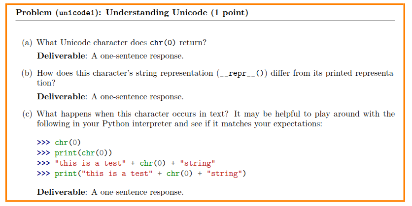
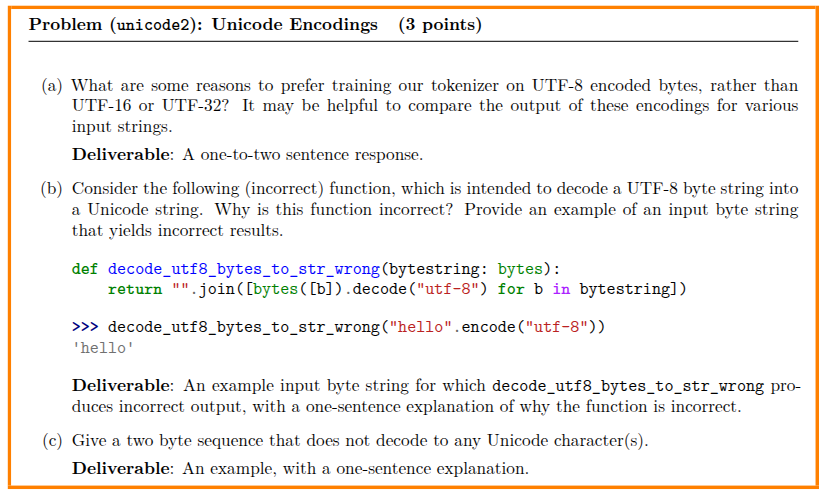
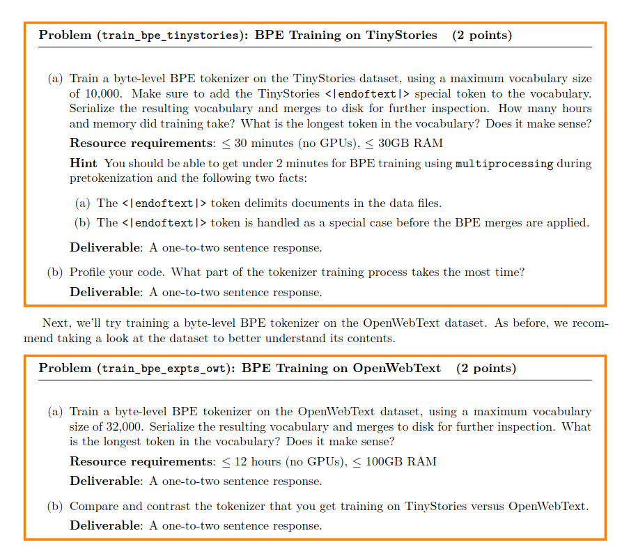

# Q1

1. 返回为空字符（U+0000）
2. \x00
3. 正常拼接

# Q2

### (a) 为什么选择 UTF-8 而不是 UTF-16 或 UTF-32？

**Deliverable (One-to-two sentence response):** UTF-8 is preferred because it uses a variable-length encoding that represents common ASCII characters with a single byte, avoiding the excessive padding and sequence bloat that wider encodings like UTF-16 or UTF-32 would introduce. This keeps the input sequence lengths manageable and memory-efficient, which is crucial for training language models.

**（中文原理解析）**：UTF-8 是互联网的主流编码（占比超过 98%）。在处理绝大多数英文文本时，UTF-8 每个字母只占 1 个字节。如果换成 UTF-32，每个字母都要占 4 个字节，比如字母 "a" 会变成 `\x00\x00\x00\x61`。这些大量的冗余空字节会导致序列变得极其冗长，拖慢模型的训练速度并增加计算成本 。

### (b) 为什么 `decode_utf8_bytes_to_str_wrong` 这个函数是错的？

**Deliverable (Example & one-sentence explanation):** Example input: `b'\xe3\x81\x93'` (the UTF-8 encoding for the Japanese character 'こ'). Explanation: The function is incorrect because it attempts to decode every single byte individually, which fails to recognize that in UTF-8, a single Unicode character can span multiple bytes.

**（中文原理解析）**：就像我们之前聊过的，UTF-8 里一个字符不一定只占一个字节 。比如汉字或者日文往往占 3 个字节 。这段错误代码强行把这 3 个字节拆散了，一次只丢给解码器 1 个字节。解码器看到残缺的 `\xe3`，根本不知道它是什么字符，自然会直接抛出 `UnicodeDecodeError` 报错。

### (c) 给出一个无法解码为任何 Unicode 字符的双字节序列。

**Deliverable (Example & one-sentence explanation):**

Example: `b'\xff\xff'`.

Explanation: This sequence does not decode to any character because the byte `\xff` is entirely illegal in the UTF-8 encoding standard, violating its strict bit-pattern rules for valid sequences.

**（中文原理解析）**：UTF-8 是一套非常严格的“拼图游戏”，比如多字节字符的首字节必须以 `110` 或 `1110` 开头，后续字节必须以 `10` 开头。像 `\xff`（二进制是 `11111111`）这种字节在 UTF-8 的规则本里是不存在的，所以哪怕你传给解码器，它也只能宣告失败。

# Q3

## Ans1 stories_train
(stories_valid很快，就不计入讨论了)

🚀 开始 BPE Workshop 调度！目标词表大小: 10000
🚀 未找到完整模型缓存，开始走完整训练流水线 [TinyStoriesV2-GPT4-train | size: 10000]...

⏳ 开始执行多进程预分词 (Pre-tokenization)...
预处理完成！正在存入本地缓存...
⏱️ 预分词彻底完成！耗时: 91.0506 秒
进度: 1000/9743 次合并完成. 当前新词: b'ect'
进度: 2000/9743 次合并完成. 当前新词: b' adventures'
进度: 3000/9743 次合并完成. 当前新词: b'ilty'
进度: 4000/9743 次合并完成. 当前新词: b' ext'
进度: 5000/9743 次合并完成. 当前新词: b' visited'
进度: 6000/9743 次合并完成. 当前新词: b' Cuddles'
进度: 7000/9743 次合并完成. 当前新词: b' horiz'
进度: 8000/9743 次合并完成. 当前新词: b' mommies'
进度: 9000/9743 次合并完成. 当前新词: b'ching'
💾 训练完成，正在保存模型文件至 vocab_merge_cache/ ...

🏆 BPE Workshop 执行完成！(含 I/O 调度) 耗时: 113.1058 秒

📊 训练后统计数据:
✅ 最终词表大小: 10000
✅ 最终合并规则: 9743 条

🔍 长度最长的前 5 个词元 (用于检验长单词学习效果):
   - 可读形态: ' accomplishment'    | 长度: 15 字节 | 底层形态: b' accomplishment'
   - 可读形态: ' disappointment'    | 长度: 15 字节 | 底层形态: b' disappointment'
   - 可读形态: ' responsibility'    | 长度: 15 字节 | 底层形态: b' responsibility'
   - 可读形态: ' uncomfortable'     | 长度: 14 字节 | 底层形态: b' uncomfortable'
   - 可读形态: ' compassionate'     | 长度: 14 字节 | 底层形态: b' compassionate'

⏱️ 统计分析耗时: 0.0009 秒
✨ 总运行耗时: 113.1068 秒

### 分析
预分词耗时最长，面对大文本输入，这也是可以理解的。
我也考虑过一些优化，比如统计并行，比如合并的时候不采用删旧增新而是通过判断继续减少次数，但我觉得没有增加复杂度的必要
我们可以看出10000词表已经足够大了，最长单词15字节，已经覆盖了绝大多数单词。

## Ans2 owt_valid
🚀 开始 BPE Workshop 调度！目标词表大小: 10000
🚀 未找到完整模型缓存，开始走完整训练流水线 [owt_train | size: 10000]...

⏳ 开始执行多进程预分词 (Pre-tokenization)...
文件大小: 11.10 GB，将被切分为约 356 块进行极速处理...
预处理完成！正在存入本地缓存...
⏱️ 预分词彻底完成！耗时: 423.8157 秒
进度: 1000/9743 次合并完成. 当前新词: b' Rep'
进度: 2000/9743 次合并完成. 当前新词: b' above'
进度: 3000/9743 次合并完成. 当前新词: b' officers'
进度: 4000/9743 次合并完成. 当前新词: b'ords'
进度: 5000/9743 次合并完成. 当前新词: b' Toronto'
进度: 6000/9743 次合并完成. 当前新词: b' consistent'
进度: 7000/9743 次合并完成. 当前新词: b' contem'
进度: 8000/9743 次合并完成. 当前新词: b' ESPN'
进度: 9000/9743 次合并完成. 当前新词: b'ordinary'
💾 训练完成，正在保存模型文件至 vocab_merge_cache/ ...

🏆 BPE Workshop 执行完成！(含 I/O 调度) 耗时: 1657.4151 秒

📊 训练后统计数据:
✅ 最终词表大小: 10000
✅ 最终合并规则: 9743 条

🔍 长度最长的前 5 个词元 (用于检验长单词学习效果):
   - 可读形态: '----------------'   | 长度: 16 字节 | 底层形态: b'----------------'
   - 可读形态: '________________'   | 长度: 16 字节 | 底层形态: b'________________'
   - 可读形态: ' representatives'   | 长度: 16 字节 | 底层形态: b' representatives'
   - 可读形态: ' administration'    | 长度: 15 字节 | 底层形态: b' administration'
   - 可读形态: ' responsibility'    | 长度: 15 字节 | 底层形态: b' responsibility'

⏱️ 统计分析耗时: 0.0019 秒
✨ 总运行耗时: 1657.4172 秒

